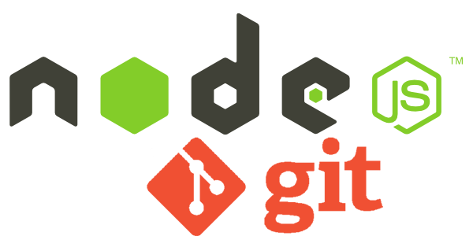

Lab 6: Node and Express 1
=======

In previous labs you have used the node shell to execute Javascript and run a simple http service. This lab introduces **node.js** as a server-side technology. Now we will use node.js to run javascript programs on the "server-side" which are capable of servicing HTTP requests.  In this lab you will learn how to:
- Create and use a remote repo on Github
- Set node up as a HTTP server.
- Use Node's built in http module to create a simple HTTP server.
- Node's packaging system.
- How to host your existing web resources in a Node.js HTTP server.
- How to do a simple route for a HTTP request.

