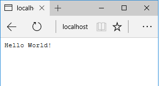

# The "Hello World" HTTP Server


We will be using node as a web application platform. In this step we'll set up a simple HTTP server that responds to every request with the plain text message "Hello World". Update *server.js*  with the following contents:

```javascript
// Load the http module to create an http server.
import http from 'http';
import config from './config';

// Configure our HTTP server to respond with Hello World to all requests.
var server = http.createServer((req, res) => {
  res.writeHead(200, {'Content-Type': 'text/plain'});
  res.end('Hello World!');
});

server.listen(config.port);

// Put a friendly message on the terminal
console.log("Server running at " + config.port);
```

In the first line, we import the http core module and assign it to ``http``. Next we assign the variable  ``server`` from the ``http.createServer(...)`` function. The argument passed into this call is the function that is called whenever an http request comes in.
Finally we call ``server.listen(config.port)`` to tell node.js the port on which we want our server to run.
To run the server open a terminal/command window in the node-lab1 folder and enter:

```
npm start
```
Now open your browser to 'http://localhost:8080'. You should see the following:

>


The connection function is invoked with a **req** and **res** object. The **req** object represents the HTTP request and is a readable stream that emits 'data' events for each incoming piece of data (like a form submission or file upload). The ***res*** object represents the HTTP response and is used to send data back to the client. In our case we are simply sending a 200 OK header, as well as the body 'Hello World'.

### Node's Module system
Node.js provides a simple module system that lets you structure your program into different files. In our *server.js* example, we use the core http module to create our HTTP service. You can also write your own modules. When creating a module, this can be interpreted as moving all related functions into a file. For example, update your *server.js* file as follows:


```javascript
// Load the http module to create an http server.
import http from 'http';
import config from './config';
import greeting  from './greeting'

// Configure our HTTP server to respond with Hello World to all requests.
var server = http.createServer((req, res) => {
  const language = req.headers['accept-language'];
  const resp_language = greeting[language]?language:'en';
  res.writeHead(200, {'Content-Type': 'text/plain' , 'Content-Language': resp_language});
  res.end(greeting[resp_language]);
});

server.listen(config.port);

console.log("Server running at " + config.port);
```

Now create a new file called 'greeting.js' in the same folder with the following content:

```javascript
const greeting = {
    en: "Hello World!",
    fr: "Bonjour!"
}

export default greeting;
```

Now test your file again using a browser. The ``export`` expose greeting to other modules that require them. To access the exported functions in our simple server, we can load the greeting module using the require function in ``import greeting from ('./greeting');``. The server gets the accepted language from the requesting process using ``req.headers["accept-language"]`` . To set the accept-language HTTP header of the request:

- install a suitable REST client. This lab will opt for [Postman](https://www.getpostman.com/).
- Perform a **HTTP GET** request to **localhost:8080** with ``Accept-language=fr``.

You should see the french representation for the greeting returned in the response.

> 

As you will see, the core modules give you very few modules. Most of the real power in Node.js is contained in the third party modules available through the Node Package Management system(NPM).

###Commit your changes
Commit the changes you have just made using git.

```script
git add -A
git commit -m "node-lab1,  simple server"
```
