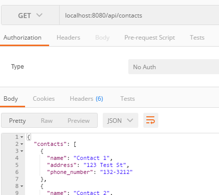

# Contacts API
We will enhance the Contacts API from last weeks lab. The following is a suggested API design for Contacts API.


# API Design
We are going to create an API to manage contact data. The proposed API is as follows:


### Set up

+ In your labs repo, copy the **node-lab1** folder from last weeks lab and name it **node-lab2**. If you do not have a solution for last weeks lab, you can get it from the samples repo at https://github.com/fxwalsh/enterprise-web-2017.git.

+ Install the following packages in your lab folder.

> ```script
npm install --save body-parser
npm install --save lodash
```
Body-parser is a middleware that express can use to parse json.

+ Update server.js to import and use **body-parser**.

> ```javascript
import body-parser from 'body-parser';
....
//configure body-parser
server.use(bodyParser.json());
server.use(bodyParser.urlencoded());
....
```

+ Before we go any further, test the 'get all contacts' service using your Rest client(e.g. Postman). This should be still working the same from last weeks lab.



## Add a Contact
+ Now update the routing script, **index.js**, to the following code.

```javascript
import express from 'express';
import contacts from './contacts';

const router = express.Router();

router.get('/', (req, res) => {
  res.send({ contacts: contacts });
});

router.post('/', (req, res) => {
		let newContact = req.body;
		if (newContact){
          contacts.push({name: newContact.name, address : newContact.address, phone_number: newContact.phone_number }) ;
          res.status(201).send({message: "Contact Created"});
      }else{
      	  res.status(400).send({message: "Unable to find Contact in request. No Contact Found in body"});
      }
});

export default router;
```

Test with your Rest Client. You will need to supply a JSON representation of the new client in the HTTP body.


## Update a Contact
+ Updating a contact involves replacing a contact with the new data in the HTTP request body. This corresponds to a PUT. Add the following routing code to the end of **/api/contacts/index.js**.


```javascript
//Update a contact
router.put('/:id', (req, res) => {
	 let key = req.params.id;
	 let updateContact = req.body;
	 var index = _.findIndex(contacts, contact => {
                 return contact.phone_number === key;
              });
            if (index !== -1) {
               contacts.splice(index, 1, {name: updateContact.name, address: updateContact.address, phone_number: updateContact.phone_number});
               res.status(200).send({message: "Contact Updated"});
              }
              else{
          res.status(400).send({message: "Unable to find Contact in request. No Contact Found in body"}) ;
      }
});

```

Test using a Rest client by doing a **HTTP PUT** using
the  URL of an existing contact as follows.

 http://localhost:8080/api/contacts/1

 You will need to include a JSON document in the HTTP body to replace it.  

## Delete a Contact

+ Include the following function and test that the function removes a contact.(e.g. perform a HTTP DELETE on http://localhost:8080/api/contacts/1)

```javascript
//Delete a contact
router.delete('/:id', (req, res) => {
	 let key = req.params.id;
   var elements = _.remove(contacts,
              contact => {
                     return contact.phone_number === key;
                  });
    if (elements){
       res.status(200).send({message: "Contact deleted"});
    }else{
      res.status(400).send({message: "Unable to find Contact. No contact Deleted"}) ;
	  }


});
```
## Commit it

Commit the changes you just made to your repo.

```
git add -A
git commit -m "added routing for add,update,delete contact"
```
