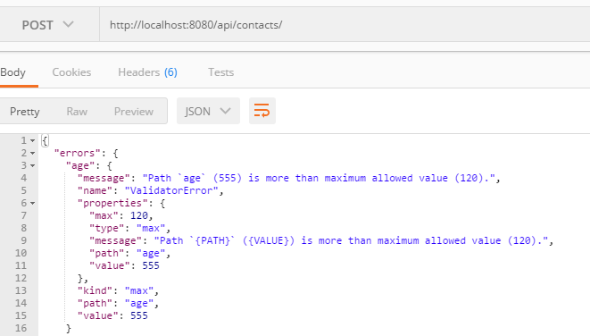

# Test the app

Use Postman to experiment with the API. Check that the following functions work:

 * GET     /contacts              ->  index
 * POST    /contacts            ->  create
 * PUT     /contacts/:id          ->  update
 * DELETE  /contacts/:id          ->  delete

Try to add a contact with an invalid age. Notice how the app responds using the built in validation provided by Mongoose.

### Custom validator

+ In */api/contacts/contactSchema.js*, add the following custom validator to ensure that the address property's length is greater than 5 characters and less than 50 characters.

```javascript
ContactSchema.path('address').validate((v)=>{
	if(v.length>50||v.length<5){
		return false;
	}
	return true;

});
```

## Challenge

Using the material covered in lectures, update your app to do the following:

+ Make the *name* and *address* fields required.
+ Validate the format of the email address (hint: write a custom validator that uses regular expressions. Check out this post [stack overflow](http://stackoverflow.com/questions/18022365/mongoose-validate-email-syntax)).
